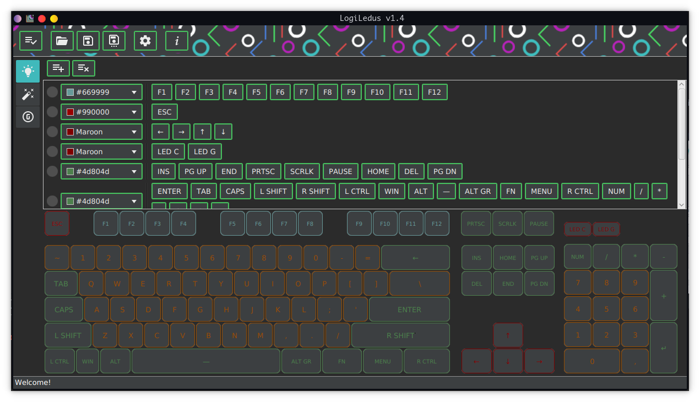
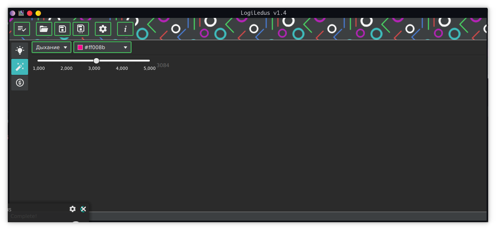
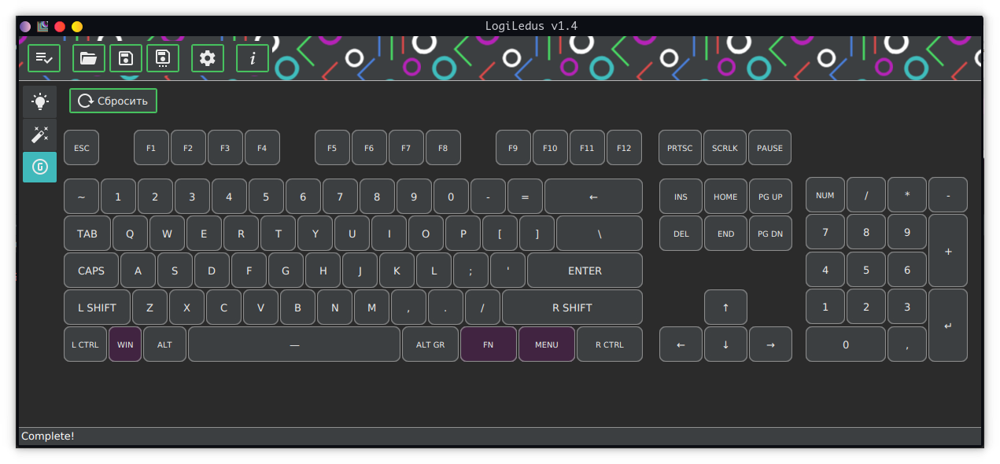

# LogiLedus

   [](https://ci.redrise.ru/repos/4)

GitHub mirror. [Click here to get it from independent source code location](https://git.redrise.ru/desu/logiledus)

Nightly builds could be found somewhere on [redrise.ru](https://redrise.ru)

[Support author](#support-this-app)

LogiLedus is a Logitech G513 Carbon GUI driver for adjusting backlight and effects.





#### License

[GNU General Public License v3](https://www.gnu.org/licenses/gpl-3.0.html)

#### Used libraries & resources
* [OpenJFX](https://wiki.openjdk.java.net/display/OpenJFX/Main)
* [usb4java](https://mvnrepository.com/artifact/org.usb4java/usb4java)
* [Jackson](https://github.com/FasterXML/jackson)
* Few icons taken from: [materialdesignicons.com](http://materialdesignicons.com/)
* Special thanks to pioneers and superstars who created, contributed and maintaining [g810-led](https://github.com/MatMoul/g810-led) project!

### System requirements

JRE/JDK 8u60 or higher.

### Usage in Linux

1. Install JRE/JDK 8u60 or higher (openJDK is good. Oracle's one is also good). JavaFX not needed (it's embedded).

2. `root # java -jar /path/to/application.jar`

3. Optional: Add user to 'udev' rules. Required to use application not only from root account.
```
root # vim /etc/udev/rules.d/99-G513.rules
SUBSYSTEM=="usb", ATTRS{idVendor}=="046D", ATTRS{idProduct}=="c33c", GROUP="plugdev"
root # udevadm control --reload-rules && udevadm trigger
```

### Build

`$ mvn package`

#### Thanks

* [DDinghoya](https://github.com/DDinghoya), who translated this application to Korean!

## Support this app

If you like this app, just give a star. 

Want to support development? Make a donation* (see below):

[ЮMoney](https://yoomoney.ru/to/410014301951665)

*Please note: this is non-commercial application.

#### TODO

* [ ] Tray support: tray icon size checks
* [ ] Headless mode (CLI)
* [x] Add opened file name to info pane 